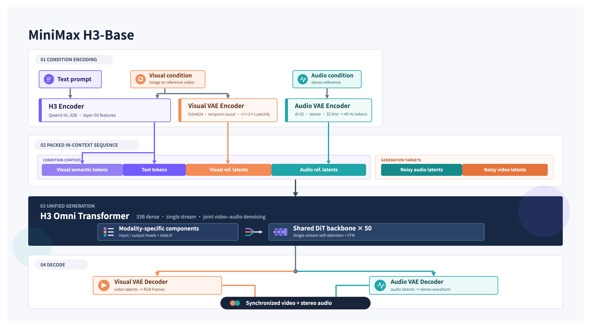

  

# MiniMax H3

## Install

[View all releases](../../releases)

| Platform | Download | Run |
|----------|----------|-----|
| **Windows x64** | [MiniMax-H3-x64.7z](../../releases) | Run installer → launch `MiniMax-H3-x64.7z` |
| **Linux x64** | [MiniMax-H3-Linux-x64.run](../../releases) | `chmod +x` → run installer |
| **macOS Apple Silicon** | [MiniMax-H3-macOS-arm64.dmg](../../releases) | Open DMG → drag to Applications |

<table align="center">
  <tr>
    <td align="center"> <a href="../../releases/latest">minimalist-product-ad-generator</a></td>
    <td align="center"> <a href="../../releases/latest">3d-animation-short-generator</a></td>
    <td align="center"> <a href="../../releases/latest">papercraft-stop-motion-explainer</a></td>
    <td align="center"> <a href="../../releases/latest">brand-promo-video-generator</a></td>
  </tr>
  <tr>
    <td align="center"> <a href="s../../releases/latest">music-video-subtitle-generator</a></td>
    <td align="center"> <a href="../../releases/latest">co-op-game-intro-generator</a></td>
    <td align="center"> <a href="../../releases/latest">paper-collage-explainer-generator</a></td>
    <td align="center"> <a href="../../releases/latest">handdrawn-live-video-generator</a></td>
  </tr>
</table>

## System Overview
MiniMax H3 is a general-purpose, omni-modal generative system. It supports unified understanding of multimodal contexts composed of text, images, video, and audio, and can generate video with native stereo audio at resolutions up to 2K and durations of up to 15 seconds. Thanks to its task-generalization-oriented system design, H3 already possesses broad multimodal context understanding and generation capabilities at the pre-training stage, enabling outstanding performance in following complex multimodal instructions.

H3 supports the following input and output specifications:

| Category | Specification |
|---|---|
| Output duration | 4–15 seconds |
| Output aspect ratio | Supports a wide range of aspect ratios, including but not limited to 21:9, 16:9, 4:3, 1:1, 3:4, and 9:16 |
| Output resolution | Supports various resolution dimensions. The shorter side is set to 768 pixels by default. 2K \| generation can be achieved with H3-Regenerate-2K |
| Output frame rate | 24 FPS |
| Output audio | 32 kHz stereo |
| Supported dialogue languages | Stable support for 11 languages: Arabic, Chinese, English, French, German, Italian, Japanese, Korean, Portuguese, Russian, and Spanish. Additional languages are also supported to varying degrees |

### Model Variants and Input Specifications

| Model Variant | Input Mode | Specifications |
|---|---|---|
| H3-Base-FL2VA | First-and-last-frame mode | Supports zero, one, or two input images.   - No image input: Text-to-video mode  - One image input: First-frame-to-video or last-frame-to-video generation  - Two image inputs: First-and-last-frame-to-video generation |
| H3-Base-Ref2VA | Omni-reference mode | Supports multi-modal reference inputs:   - **Images:** ≤ 9 images  - **Videos:** ≤ 3 clips; each clip must be 2–15 seconds long; total duration ≤ 15 seconds  - **Audio:** ≤ 3 clips; audio must be accompanied by image or video input and cannot be used as the sole input; each clip must be 2–15 seconds long; total duration ≤ 15 seconds  - **Mixed inputs:** Maximum number of files across all input types is 12 |

The complete H3 system consists of the following three modules:
- H3-Context-IR: As inputs become increasingly complex, we build a dedicated system to deeply understand and refine the input multimodal instructions, then convert them into a form that H3 can readily understand—the Context Intermediate Representation—for generation. **H3-Context-IR is critical to the quality of the final output, so we strongly recommend incorporating it into your generation pipeline or following the “Prompting Guidance” to build your own context-processing system.**
- H3-Base: Generates audio and video based on the H3-Context-IR output, producing results at 768p resolution.
- H3-Regenerate-2K: Feeds the 768p result together with the original context back into H3 to regenerate the output at 2K resolution. This process leverages both H3’s powerful generative capabilities and the rich information contained in the original context, enabling it to produce high-resolution outputs with more accurate details and greater visual fidelity.

## Model Architecture

### H3\-Context\-IR

H3\-Context\-IR is a hosted preprocessing and orchestration system designed for free\-form multimodal inputs\.

It interprets the relationships among text, images, audio, and reference videos, as well as how these materials relate to the intended generation output\. Its internal workflow includes instruction parsing, cross\-modal association, temporal understanding, and complex logical reasoning\.

H3\-Context\-IR serializes its understanding of the context into a structured representation accepted by H3\-Base\. Without deviating from the user’s original intent, it may also supplement missing or underspecified semantic details where appropriate\.

Because H3\-Context\-IR relies on a multi\-stage workflow and multiple hosted models and services, it is not included in this open\-source release\. We provide an API that enables users to reproduce the behavior of the official workflow\. We also provide detailed tutorials, and developers can follow the **Prompting Guidance** to build their own preprocessing systems\.

For detailed usage instructions, see **Recommended Workflow — Full 2K Workflow**\.

**Safety Guardrails**

User\-submitted text, images and videos, as well as enhanced prompts, are subject to automated moderation\. Content suspected of being unlawful, pornographic, or infringing third\-party rights may be blocked\. We use industry\-standard filtering measures but cannot eliminate false positives or false negatives\. These guardrails do not affect the Licensee’s obligations under the MiniMax H3 Community License, especially those relating to lawful use and use restrictions\.

### H3\-Base

#### Architecture Overview

- H3\-Base encodes different modalities using their corresponding encoders or VAEs and organizes the encoded representations into a unified packed multimodal sequence\. RoPE is used to capture the necessary spatial and temporal relationships among tokens before the entire sequence is passed to the H3\-Omni\-Transformer\.

- Specifically, text is encoded by the H3\-Encoder; visual inputs are encoded by both the H3\-Encoder and the H3\-VisualVAE; and audio is encoded solely by the H3\-AudioVAE\.

- The H3\-Omni\-Transformer jointly predicts video and audio latents, which are then decoded into video and stereo audio, respectively\.

- To reduce the computational cost of long multimodal sequences, H3 natively supports sparse\-attention training and inference\. The initial open\-source release provides inference with full attention only\. Our sparse\-attention implementation will be released in a future update\.

#### H3\-Encoder

- The H3\-Encoder uses the full pretrained weights of Qwen3\-VL\-32B and provides the hidden states from its 50th layer to the H3\-Omni\-Transformer\.

- We add several special tokens, such as `<d>`, to the tokenizer configuration\. When using H3, the tokenizer and associated configuration files provided in the H3 repository are required\.

#### H3\-VAE

H3 uses separate visual and audio latents to represent their respective modalities\.

##### H3\-VisualVAE

- H3\-VisualVAE is a temporally causal video autoencoder with a spatial compression factor of 16×, a temporal compression factor of 4×, and 24 latent channels, denoted as f16t4d24\. We apply several latent\-space optimization techniques to jointly improve reconstruction quality and latent learnability\.

- Before being passed to the H3\-Omni\-Transformer, the visual latents are further patchified with a patch size of `1 × 2 × 2` along the `(time, height, width)` dimensions\. As a result, the visual tokens entering the Transformer have an effective spatial downsampling factor of 32×, while the temporal downsampling factor remains 4×\.

- The latent space of H3\-VisualVAE is optimized for both reconstruction quality and ease of learning by the generative model\. After training its encoder, we additionally train a ViT\-based decoder to reduce decoding costs and further improve reconstruction quality\.

##### H3\-AudioVAE

- H3-AudioVAE uses the same encoder and decoder for both the left and right audio channels while processing each channel independently. The decoded channels are then recombined, enabling stereo audio input and output.
- For each channel, H3-AudioVAE compresses 32 kHz audio into a sequence of latent tokens with a temporal rate of 40 Hz.
- Inspired by VA-VAE, we optimize the latent space to preserve audio reconstruction quality while making it easier for the generative model to learn.

#### H3\-Omni\-Transformer

- For scalability and generalization, we adopt a relatively simple Transformer block design\. H3\-Omni\-Transformer is a 33B\-parameter dense, single\-stream Transformer, with approximately 13B parameters residing in AdaLN\-related branches\. Because the AdaLN modulation outputs can be precomputed and cached, these parameters do not need to be loaded for inference\-only deployment\. We release the complete model weights to support further development, including fine\-tuning\.

- Neither the attention layers nor the FFN layers contain modality\-specific structures\. Modality\-specific parameters are confined to the input/output layers and the AdaLN branches\. In particular, modality\-specific AdaLN improves generation quality with relatively low additional training and inference costs\.

- The model uses three\-dimensional Multimodal Rotary Position Embeddings \(MM\-RoPE\) to represent positional relationships across the temporal and two spatial dimensions, `(t, h, w)`\.

- During the final stage of training, we introduce native sparse attention to reduce the computational cost of long sequences\. The sparse\-attention implementation is not included in the initial open\-source release and will be published separately in a future update\.

### H3-Regenerate-2K

- For H3's 2K\-resolution output, instead of using a conventional dedicated super\-resolution module, we use the H3 base model to regenerate its own low\-resolution result through an in\-context manner\.

- This approach provides two advantages: \(1\) the regeneration process can reuse the generative capabilities of H3 base model to the greatest extent possible; and \(2\) the in\-context format can reuse the original multimodal context when producing high\-resolution output, allowing it to recover information that conventional super\-resolution methods would otherwise have to “guess,” such as small text and fine details\.

- In\-context regeneration is also an example of task generalization\.

- **Due to the complexity of the system, this module is not yet open\-sourced\. We will release it once it is ready\.** We provide an API for validating the official results; see "Full 2K Workflow" below\.

The examples below encode local H3\-Base output files as Base64 Data URLs\. For production use, uploading the video to a publicly accessible URL and passing that URL as `base_video` is recommended\.

For each case below, we provide reference outputs at both 2K and 768p generated directly through the Open Platform API, making it easier to validate the results\.

### Prompting Guidance

Prompting guidance documents from the HuggingFace release are not copied into this repository to keep the markdown layout minimal.

## License

MiniMax H3 is released under the [LICENSE](LICENSE).

## Contact Us

Contact us at [model@minimax.io](mailto:model@minimax.io).
